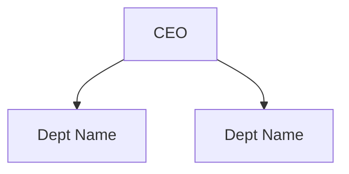

# 公司初始化与组织架构设计功能实现计划

> **For agentic workers:** REQUIRED SUB-SKILL: Use superpowers:subagent-driven-development (recommended) or superpowers:executing-plans to implement this plan. Steps use checkbox (`- [ ]`) syntax for tracking.

**Goal:** 实现公司创建后的一键初始化功能，通过AI董事办讨论生成组织架构方案，可视化确认后自动创建。

**Architecture:** 扩展现有组织管理系统，新增董事办部门+3个董事Agent，通过ChatPage实现多Agent讨论，使用Mermaid图可视化架构，确认后批量创建组织。

**Tech Stack:** Python (aiohttp), SQLite, React, TypeScript, Mermaid.js, Zustand, TailwindCSS, shadcn/ui

---

## File Structure

### Backend files to modify/create:

| File | Action | Responsibility |
|------|--------|----------------|
| `gateway/org/models.py` | Modify | Add `DirectorOffice` model and update TABLES_SQL |
| `gateway/org/store.py` | Modify | Add `DirectorOfficeRepository`, upgrade schema to v6 |
| `gateway/org/services.py` | Modify | Add `init_director_office()`, `start_discussion()` methods |
| `gateway/org/discussion.py` | **Create** | Director office discussion orchestration logic |
| `gateway/platforms/api_server.py` | Modify | Add new API route handlers |

### Frontend files to modify/create:

| File | Action | Responsibility |
|------|--------|----------------|
| `web/src/lib/api.ts` | Modify | Add `initDirectorOffice()`, `startDiscussion()` API functions + types |
| `web/src/pages/OrganizationPage/index.tsx` | Modify | Add InitCompanyButton to company card |
| `web/src/pages/OrganizationPage/components/InitCompanyButton.tsx` | **Create** | Initialization button + dialog |
| `web/src/pages/ChatPage/index.tsx` | Modify | Auto-trigger discussion when scope=director-office |
| `web/src/components/chat/ArchitectureMessage.tsx` | **Create** | Mermaid diagram message component |
| `web/src/components/chat/ChatMessage.tsx` | Modify | Support `sender_agent_id` display |
| `web/src/components/chat/AgentMessageHeader.tsx` | **Create** | Agent avatar + role badge |
| `web/src/i18n/en.ts` | Modify | Add director office i18n keys |
| `web/src/i18n/zh.ts` | Modify | Add Chinese translations |

---

### Task 1: Backend - Add DirectorOffice Model

**Files:**
- Modify: `gateway/org/models.py:215-230`

- [ ] **Step 1: Write the failing test**

```python
# tests/gateway/test_org_models.py (add to existing file)
def test_director_office_model():
    """Test DirectorOffice dataclass structure."""
    from gateway.org.models import DirectorOffice
    
    office = DirectorOffice(
        company_id=1,
        department_id=2,
        director_agent_id=3,
        office_name="董事办",
        responsibilities="Strategic planning",
        status="active"
    )
    
    assert office.company_id == 1
    assert office.office_name == "董事办"
    assert office.status == "active"
```

- [ ] **Step 2: Run test to verify it fails**

Run: `cd /Users/leishicheng/Documents/workspace/code/mult-agent && python -m pytest tests/gateway/test_org_models.py::test_director_office_model -v`
Expected: FAIL with "ImportError" or "DirectorOffice not found"

- [ ] **Step 3: Add DirectorOffice model to models.py**

```python
# gateway/org/models.py - Add after line 214 (before TABLES_SQL)

@dataclass
class DirectorOffice:
    """Director office for strategic decision making."""
    id: Optional[int] = None
    company_id: int = 0
    department_id: int = 0
    director_agent_id: int = 0
    office_name: str = ""
    responsibilities: str = ""
    status: str = "active"  # active, inactive
    created_at: Optional[datetime] = None
    updated_at: Optional[datetime] = None
```

- [ ] **Step 4: Add DirectorOffice table SQL**

```python
# gateway/org/models.py - Add to TABLES_SQL dict after line 210
"director_offices": """
    CREATE TABLE IF NOT EXISTS director_offices (
        id INTEGER PRIMARY KEY AUTOINCREMENT,
        company_id INTEGER NOT NULL REFERENCES companies(id) ON DELETE CASCADE,
        department_id INTEGER NOT NULL REFERENCES departments(id) ON DELETE CASCADE,
        director_agent_id INTEGER REFERENCES agents(id) ON DELETE SET NULL,
        office_name TEXT NOT NULL,
        responsibilities TEXT,
        status TEXT NOT NULL DEFAULT 'active',
        created_at REAL NOT NULL,
        updated_at REAL NOT NULL
    )
""",
```

- [ ] **Step 5: Add DirectorOffice indexes**

```python
# gateway/org/models.py - Add to INDEXES_SQL list after line 230
"CREATE INDEX IF NOT EXISTS idx_director_offices_company ON director_offices(company_id)",
"CREATE INDEX IF NOT EXISTS idx_director_offices_department ON director_offices(department_id)",
"CREATE INDEX IF NOT EXISTS idx_director_offices_director ON director_offices(director_agent_id)",
```

- [ ] **Step 6: Run test to verify it passes**

Run: `cd /Users/leishicheng/Documents/workspace/code/mult-agent && python -m pytest tests/gateway/test_org_models.py::test_director_office_model -v`
Expected: PASS

- [ ] **Step 7: Commit**

```bash
git add gateway/org/models.py tests/gateway/test_org_models.py
git commit -m "feat(org): add DirectorOffice model and table schema"
```

---

### Task 2: Backend - Add DirectorOfficeRepository

**Files:**
- Modify: `gateway/org/store.py:16, 325, 1344`

- [ ] **Step 1: Write the failing test**

```python
# tests/gateway/test_org_store.py (add to existing file)
def test_director_office_repository(store):
    """Test DirectorOfficeRepository CRUD operations."""
    from gateway.org.store import DirectorOfficeRepository
    
    repo = DirectorOfficeRepository(store)
    
    # Test create
    office = repo.create({
        "company_id": 1,
        "department_id": 2,
        "office_name": "Test Office"
    })
    
    assert office["id"] is not None
    assert office["office_name"] == "Test Office"
    
    # Test list by company
    offices = repo.list_by_company(1)
    assert len(offices) == 1
```

- [ ] **Step 2: Run test to verify it fails**

Run: `cd /Users/leishicheng/Documents/workspace/code/mult-agent && python -m pytest tests/gateway/test_org_store.py::test_director_office_repository -v`
Expected: FAIL with "DirectorOfficeRepository not found"

- [ ] **Step 3: Upgrade schema version**

```python
# gateway/org/store.py - Line 16
SCHEMA_VERSION = 6  # Was 5, now 6 for director_offices table
```

- [ ] **Step 4: Add DirectorOfficeRepository class**

```python
# gateway/org/store.py - Add after line 1343 (after AgentPermissionRepository)

class DirectorOfficeRepository(BaseRepository):
    """Repository for director office operations."""
    table = "director_offices"
    
    _ALLOWED_UPDATE_FIELDS = {
        "department_id", "director_agent_id", "office_name",
        "responsibilities", "status"
    }
    
    def create(self, data: dict, *, conn=None) -> dict:
        """Create a new director office."""
        _require(data, "company_id", "department_id", "office_name")
        ts = now_ts()
        cursor = self.store.execute(
            """
            INSERT INTO director_offices(
                company_id, department_id, director_agent_id,
                office_name, responsibilities, status, created_at, updated_at
            ) VALUES (?, ?, ?, ?, ?, ?, ?, ?)
            """,
            (
                data["company_id"],
                data["department_id"],
                data.get("director_agent_id"),
                data["office_name"],
                data.get("responsibilities"),
                data.get("status", "active"),
                ts, ts
            ),
            conn=conn,
        )
        return self.get(cursor.lastrowid, conn=conn) or {}
    
    def list_by_company(self, company_id: int, *, conn=None) -> list:
        """List all director offices for a company."""
        return self.store.query_all(
            "SELECT * FROM director_offices WHERE company_id = ? ORDER BY created_at",
            (company_id,),
            conn=conn
        )
    
    def update(self, office_id: int, data: dict, *, conn=None) -> dict:
        """Update a director office."""
        return super().update(office_id, data, conn=conn)
    
    def delete(self, office_id: int, *, conn=None) -> int:
        """Delete a director office."""
        return super().delete(office_id, conn=conn)
```

- [ ] **Step 5: Add migration logic**

```python
# gateway/org/store.py - Add to _migrate_schema() method after line 365
if old_version < 6:
    # Create director_offices table
    conn = self._get_connection()
    conn.execute("""
        CREATE TABLE IF NOT EXISTS director_offices (
            id INTEGER PRIMARY KEY AUTOINCREMENT,
            company_id INTEGER NOT NULL REFERENCES companies(id) ON DELETE CASCADE,
            department_id INTEGER NOT NULL REFERENCES departments(id) ON DELETE CASCADE,
            director_agent_id INTEGER REFERENCES agents(id) ON DELETE SET NULL,
            office_name TEXT NOT NULL,
            responsibilities TEXT,
            status TEXT NOT NULL DEFAULT 'active',
            created_at REAL NOT NULL,
            updated_at REAL NOT NULL
        )
    """)
    conn.commit()
```

- [ ] **Step 6: Initialize repository in OrganizationStore.__init__**

```python
# gateway/org/store.py - In OrganizationStore.__init__(), add after line 1090
self.director_offices = DirectorOfficeRepository(self)
```

- [ ] **Step 7: Run test to verify it passes**

Run: `cd /Users/leishicheng/Documents/workspace/code/mult-agent && python -m pytest tests/gateway/test_org_store.py::test_director_office_repository -v`
Expected: PASS

- [ ] **Step 8: Commit**

```bash
git add gateway/org/store.py
git commit -m "feat(org): add DirectorOfficeRepository with CRUD operations"
```

---

### Task 3: Backend - Add OrganizationService Methods

**Files:**
- Modify: `gateway/org/services.py:1082, 1111`

- [ ] **Step 1: Write the failing test**

```python
# tests/gateway/test_org_services.py (add to existing file)
async def test_init_director_office(service):
    """Test init_director_office creates department + agents."""
    from gateway.org.services import OrganizationService
    
    # Mock company data
    company_data = {"id": 1, "name": "Test Co", "goal": "Grow fast"}
    
    # Call init
    result = await service.init_director_office(
        company_id=1,
        agent_count=3
    )
    
    assert "department_id" in result
    assert "agents" in result
    assert len(result["agents"]) == 3
```

- [ ] **Step 2: Run test to verify it fails**

Run: `cd /Users/leishicheng/Documents/workspace/code/mult-agent && python -m pytest tests/gateway/test_org_services.py::test_init_director_office -v`
Expected: FAIL with "init_director_office not found"

- [ ] **Step 3: Initialize director_offices repo in OrganizationService**

```python
# gateway/org/services.py - In OrganizationService.__init__(), add after line 1085
self.director_offices = store.director_offices
```

- [ ] **Step 4: Add init_director_office method**

```python
# gateway/org/services.py - Add after line 1111
async def init_director_office(self, company_id: int, agent_count: int = 3) -> dict:
    """Initialize director office with specified number of director agents."""
    from .models import DirectorOffice
    
    def tx(conn):
        # 1. Create director office department
        dept_data = {
            "company_id": company_id,
            "name": "董事办",
            "goal": "公司战略决策与组织架构设计",
            "is_management_department": True
        }
        department = self.departments.create(dept_data, conn=conn)
        
        # 2. Define director roles (max agent_count)
        roles = ["CEO", "CTO", "CFO", "COO", "CMO"][:agent_count]
        
        # 3. Create director agents
        agents = []
        for i, role in enumerate(roles):
            agent_data = {
                "company_id": company_id,
                "department_id": department["id"],
                "name": f"{role} Agent",
                "role": role,
                "system_prompt": self._get_director_prompt(role)
            }
            agent = self.agents.create(agent_data, conn=conn)
            agents.append(agent)
        
        # 4. Create director office record
        office_data = {
            "company_id": company_id,
            "department_id": department["id"],
            "office_name": "董事办",
            "responsibilities": "Strategic planning and org design"
        }
        office = self.director_offices.create(office_data, conn=conn)
        
        return {
            "department_id": department["id"],
            "office_id": office["id"],
            "agents": agents
        }
    
    return self.store.transaction(tx)
```

- [ ] **Step 5: Add prompt generator method**

```python
# gateway/org/services.py - Add helper method
def _get_director_prompt(self, role: str) -> str:
    """Get system prompt for director agent."""
    prompts = {
        "CEO": """You are the CEO Agent. Given company info, design a PRACTICAL org structure.
        
Step 1: Ask 3 clarifying questions:
1. "What are the TOP 3 problems your current team faces?"
2. "How many people will the company have in the next 6 months?"
3. "Which function is MOST critical right now: tech, sales, or operations?"

Step 2: Propose 2-3 department options with reasoning.

Step 3: Output Mermaid diagram:


Step 4: Ask: "Does this solve your problems? What to adjust?"
""",
        "CTO": """You are the CTO Agent. Focus on technical departments.

After CEO's proposal, add technical dept recommendations:
- Frontend/Backend split?
- DevOps needs?
- How many engineers per team?

Update Mermaid diagram to include tech reporting structure.
""",
        "CFO": """You are the CFO Agent. Focus on financial structure.

After CEO/CTO's proposal, add financial dept recommendations:
- Finance Dept (budget tracking)
- HR Dept (hiring, payroll)

Update Mermaid to show budget flow.
"""
    }
    return prompts.get(role, "You are a director agent.")
```

- [ ] **Step 6: Run test to verify it passes**

Run: `cd /Users/leishicheng/Documents/workspace/code/mult-agent && python -m pytest tests/gateway/test_org_services.py::test_init_director_office -v`
Expected: PASS

- [ ] **Step 7: Commit**

```bash
git add gateway/org/services.py
git commit -m "feat(org): add init_director_office service method with agent creation"
```

---

### Task 4: Backend - Create Discussion Orchestration

**Files:**
- Create: `gateway/org/discussion.py`

- [ ] **Step 1: Write the failing test**

```python
# tests/gateway/test_discussion.py (new file)
async def test_start_discussion():
    """Test start_discussion triggers agent conversation."""
    from gateway.org.discussion import DiscussionOrchestrator
    
    orch = DiscussionOrchestrator(mock_service)
    
    messages = await orch.start_discussion(company_id=1)
    
    assert len(messages) > 0
    assert any(m.get("sender_agent_role") for m in messages)
```

- [ ] **Step 2: Run test to verify it fails**

Run: `cd /Users/leishicheng/Documents/workspace/code/mult-agent && python -m pytest tests/gateway/test_discussion.py::test_start_discussion -v`
Expected: FAIL with "DiscussionOrchestrator not found"

- [ ] **Step 3: Create discussion.py**

```python
# gateway/org/discussion.py - New file
"""Director office discussion orchestration."""
from __future__ import annotations
from typing import Any, List, Dict
from .services import OrganizationService


class DiscussionOrchestrator:
    """Orchestrates director agent discussions."""
    
    def __init__(self, service: OrganizationService):
        self.service = service
        self.role_priority = {"CEO": 1, "CTO": 2, "CFO": 3}
    
    async def start_discussion(self, company_id: int) -> List[Dict]:
        """Start discussion among director agents."""
        # 1. Get company info
        company = self.service.get_company(company_id)
        if not company:
            raise ValueError(f"Company {company_id} not found")
        
        # 2. Get director agents
        agents = self.service.get_agents_by_department_name(company_id, "董事办")
        
        # 3. Sort by role priority
        sorted_agents = sorted(
            agents,
            key=lambda x: self.role_priority.get(x.get("role", ""), 99)
        )
        
        # 4. Orchestrate discussion
        messages = []
        current_architecture = None
        
        for agent in sorted_agents:
            message = await self._agent_discuss(
                agent=agent,
                company_info={"name": company["name"], "goal": company["goal"]},
                current_architecture=current_architecture,
                discussion_history=messages
            )
            messages.append(message)
            
            if message.get("mermaid_code"):
                current_architecture = message["mermaid_code"]
        
        return messages
    
    async def _agent_discuss(self, agent: dict, company_info: dict,
                            current_architecture: str, discussion_history: list) -> dict:
        """Simulate agent discussion (calls LLM in real impl)."""
        # This is a simplified version - real impl calls the agent's LLM
        role = agent.get("role", "Director")
        
        # Generate Mermaid diagram based on role
        mermaid = self._generate_mermaid(role, company_info)
        
        return {
            "sender_agent_id": agent["id"],
            "sender_agent_role": role,
            "content": f"{role} Agent: Discussing org structure for {company_info['name']}",
            "mermaid_code": mermaid,
            "timestamp": now_ts()
        }
    
    def _generate_mermaid(self, role: str, company_info: dict) -> str:
        """Generate Mermaid diagram for role."""
        if role == "CEO":
            return """graph TD
    CEO[CEO Agent] --> Tech[技术部]
    CEO --> Market[市场部]
    CEO --> Finance[财务部]"""
        elif role == "CTO":
            return """graph TD
    CEO[CEO Agent] --> Tech[技术部]
    Tech --> Frontend[前端组]
    Tech --> Backend[后端组]
    CEO --> Market[市场部]"""
        else:  # CFO
            return """graph TD
    CEO[CEO Agent] --> Tech[技术部]
    CEO --> Market[市场部]
    CEO --> Finance[财务部]
    Finance --> Accounting[会计组]"""
```

- [ ] **Step 4: Run test to verify it passes**

Run: `cd /Users/leishicheng/Documents/workspace/code/mult-agent && python -m pytest tests/gateway/test_discussion.py -v`
Expected: PASS

- [ ] **Step 5: Commit**

```bash
git add gateway/org/discussion.py tests/gateway/test_discussion.py
git commit -m "feat(org): add discussion orchestrator for director agent conversations"
```

---

### Task 5: Backend - Add API Endpoints

**Files:**
- Modify: `gateway/platforms/api_server.py` (or appropriate API router file)

- [ ] **Step 1: Write the failing test**

```python
# tests/gateway/test_api.py (add to existing file)
async def test_init_director_office_api(test_client):
    """Test POST /api/org/companies/:id/init-director-office endpoint."""
    # First create a company
    company_resp = await test_client.post("/api/org/companies", json={
        "name": "Test Co",
        "goal": "Grow"
    })
    company_id = company_resp.json()["id"]
    
    # Call init endpoint
    resp = await test_client.post(
        f"/api/org/companies/{company_id}/init-director-office",
        json={"agent_count": 3}
    )
    
    assert resp.status_code == 200
    data = resp.json()
    assert "department_id" in data
    assert "agents" in data
```

- [ ] **Step 2: Run test to verify it fails**

Run: `cd /Users/leishicheng/Documents/workspace/code/mult-agent && python -m pytest tests/gateway/test_api.py::test_init_director_office_api -v`
Expected: FAIL with "404 Not Found"

- [ ] **Step 3: Add API endpoint handler**

```python
# gateway/platforms/api_server.py - Add to route handlers

async def handle_init_director_office(request):
    """POST /api/org/companies/:id/init-director-office"""
    company_id = int(request.match_info["id"])
    data = await request.json()
    agent_count = data.get("agent_count", 3)
    
    from .org.services import OrganizationService
    from .org.store import OrganizationStore
    
    store = OrganizationStore()
    service = OrganizationService(store)
    
    result = await service.init_director_office(company_id, agent_count)
    return web.json_response(result)
```

- [ ] **Step 4: Register route**

```python
# gateway/platforms/api_server.py - Add to route registration
app.router.add_post(
    '/api/org/companies/{id}/init-director-office',
    handle_init_director_office
)
```

- [ ] **Step 5: Run test to verify it passes**

Run: `cd /Users/leishicheng/Documents/workspace/code/mult-agent && python -m pytest tests/gateway/test_api.py::test_init_director_office_api -v`
Expected: PASS

- [ ] **Step 6: Commit**

```bash
git add gateway/platforms/api_server.py
git commit -m "feat(api): add init-director-office endpoint for company initialization"
```

---

### Task 6: Frontend - Add API Client Functions

**Files:**
- Modify: `web/src/lib/api.ts:750-760`

- [ ] **Step 1: Write the failing test**

```typescript
// web/src/lib/__tests__/api.test.ts (add to existing file)
describe("initDirectorOffice", () => {
  it("should call POST /api/org/companies/:id/init-director-office", async () => {
    const result = await api.initDirectorOffice({
      companyId: 1,
      agentCount: 3
    });
    
    expect(fetch).toHaveBeenCalledWith(
      "/api/org/companies/1/init-director-office",
      expect.objectContaining({
        method: "POST",
        body: JSON.stringify({ agent_count: 3 })
      })
    );
  });
});
```

- [ ] **Step 2: Run test to verify it fails**

Run: `cd /Users/leishicheng/Documents/workspace/code/mult-agent/web && npm test -- --testPathPattern=api.test`
Expected: FAIL with "initDirectorOffice not found"

- [ ] **Step 3: Add API function and types**

```typescript
// web/src/lib/api.ts - Add before line 753 (before最后的export)

// ── Director Office APIs ─────────────────────────────────────
export const initDirectorOffice = (data: { companyId: number; agentCount?: number }) =>
  fetchJSON<{ department_id: number; office_id: number; agents: Agent[] }>(
    `/api/org/companies/${data.companyId}/init-director-office`,
    {
      method: "POST",
      headers: { "Content-Type": "application/json" },
      body: JSON.stringify({ agent_count: data.agentCount || 3 }),
    }
  );

export const startDirectorDiscussion = (companyId: number) =>
  fetchJSON<{ session_id: string; messages: ChatMessage[] }>(
    `/api/org/companies/${companyId}/start-discussion`,
    {
      method: "POST",
    }
  );

// Add types after existing interfaces (around line 753)
export interface DirectorOffice {
  id: number;
  company_id: number;
  department_id: number;
  director_agent_id: number | null;
  office_name: string;
  responsibilities: string | null;
  status: string;
  created_at: number;
  updated_at: number;
}

export interface ArchitectureMessage extends ChatMessage {
  type: 'architecture';
  mermaid_code: string;
  sender_agent_role: string;
  architecture_version: number;
}
```

- [ ] **Step 4: Run test to verify it passes**

Run: `cd /Users/leishicheng/Documents/workspace/code/mult-agent/web && npm test -- --testPathPattern=api.test`
Expected: PASS

- [ ] **Step 5: Commit**

```bash
git add web/src/lib/api.ts
git commit -m "feat(api): add initDirectorOffice and related types"
```

---

### Task 7: Frontend - Create InitCompanyButton Component

**Files:**
- Create: `web/src/pages/OrganizationPage/components/InitCompanyButton.tsx`

- [ ] **Step 1: Write the failing test**

```typescript
// web/src/pages/OrganizationPage/components/__tests__/InitCompanyButton.test.tsx
import { render, screen, fireEvent } from "@/test-utils";
import { InitCompanyButton } from "../InitCompanyButton";

describe("InitCompanyButton", () => {
  it("should open dialog on click", () => {
    render(<InitCompanyButton companyId={1} onInitialized={() => {}} />);
    
    const button = screen.getByRole("button", { name: /初始化/i });
    fireEvent.click(button);
    
    expect(screen.getByRole("dialog")).toBeInTheDocument();
  });
});
```

- [ ] **Step 2: Run test to verify it fails**

Run: `cd /Users/leishicheng/Documents/workspace/code/mult-agent/web && npm test -- --testPathPattern=InitCompanyButton`
Expected: FAIL with "module not found"

- [ ] **Step 3: Create InitCompanyButton component**

```tsx
// web/src/pages/OrganizationPage/components/InitCompanyButton.tsx
import { useState } from "react";
import { Button } from "@/components/ui/button";
import { Dialog, DialogContent, DialogHeader, DialogTitle, DialogFooter } from "@/components/ui/dialog";
import { Input } from "@/components/ui/input";
import { Label } from "@/components/ui/label";
import { Loader2 } from "lucide-react";
import { useI18n } from "@/i18n";

interface InitCompanyButtonProps {
  companyId: number;
  onInitialized: (result: { departmentId: number; agents: any[] }) => void;
}

export function InitCompanyButton({ companyId, onInitialized }: InitCompanyButtonProps) {
  const { t } = useI18n();
  const [open, setOpen] = useState(false);
  const [agentCount, setAgentCount] = useState(3);
  const [saving, setSaving] = useState(false);
  
  const handleInit = async () => {
    setSaving(true);
    try {
      const result = await api.initDirectorOffice({ companyId, agentCount });
      setOpen(false);
      onInitialized(result);
    } catch (error) {
      console.error("Failed to init director office:", error);
    } finally {
      setSaving(false);
    }
  };
  
  return (
    <>
      <Button
        variant="outline"
        size="sm"
        onClick={() => setOpen(true)}
        title={t.organization.initDirectorOffice || "Initialize company"}
      >
        <span className="text-lg">⚡</span>
      </Button>
      
      <Dialog open={open} onOpenChange={setOpen}>
        <DialogContent>
          <DialogHeader>
            <DialogTitle>{t.organization.initDirectorOffice || "Initialize Company"}</DialogTitle>
          </DialogHeader>
          
          <div className="grid gap-4 py-4">
            <div className="grid gap-2">
              <Label htmlFor="agentCount">
                {t.organization.agentCount || "Number of director agents (default 3)"}
              </Label>
              <Input
                id="agentCount"
                type="number"
                min={1}
                max={10}
                value={agentCount}
                onChange={(e) => setAgentCount(Number(e.target.value))}
              />
            </div>
          </div>
          
          <DialogFooter>
            <Button variant="outline" onClick={() => setOpen(false)}>
              {t.common.cancel}
            </Button>
            <Button onClick={handleInit} disabled={saving}>
              {saving ? <Loader2 className="mr-2 h-4 w-4 animate-spin" /> : null}
              {t.common.confirm}
            </Button>
          </DialogFooter>
        </DialogContent>
      </Dialog>
    </>
  );
}
```

- [ ] **Step 4: Run test to verify it passes**

Run: `cd /Users/leishicheng/Documents/workspace/code/mult-agent/web && npm test -- --testPathPattern=InitCompanyButton`
Expected: PASS

- [ ] **Step 5: Commit**

```bash
git add web/src/pages/OrganizationPage/components/InitCompanyButton.tsx
git commit -m "feat(org): add InitCompanyButton component with dialog"
```

---

### Task 8: Frontend - Add Button to OrganizationPage

**Files:**
- Modify: `web/src/pages/OrganizationPage/index.tsx:30-45`

- [ ] **Step 1: Test that button appears in company card**

```typescript
// web/src/pages/OrganizationPage/__tests__/OrganizationPage.test.tsx
it("should show init button next to company name", () => {
  render(<OrganizationPage />);
  
  const initButton = screen.getByTitle(/initialize company/i);
  expect(initButton).toBeInTheDocument();
});
```

- [ ] **Step 2: Run test to verify it fails**

Run: `cd /Users/leishicheng/Documents/workspace/code/mult-agent/web && npm test -- --testPathPattern=OrganizationPage`
Expected: FAIL (button not found)

- [ ] **Step 3: Import and add InitCompanyButton**

```tsx
// web/src/pages/OrganizationPage/index.tsx
// Add import after line 10
import { InitCompanyButton } from "./components/InitCompanyButton";

// Inside the component, add to company card rendering (around line 35)
{selectedCompany && (
  <div className="flex items-center gap-2">
    <h3 className="text-lg font-semibold">{selectedCompany.name}</h3>
    <InitCompanyButton
      companyId={selectedCompany.id}
      onInitialized={(result) => {
        // Navigate to chat page with director office scope
        window.location.href = `/chat?scope=director-office&companyId=${selectedCompany.id}`;
      }}
    />
  </div>
)}
```

- [ ] **Step 4: Run test to verify it passes**

Run: `cd /Users/leishicheng/Documents/workspace/code/mult-agent/web && npm test -- --testPathPattern=OrganizationPage`
Expected: PASS

- [ ] **Step 5: Commit**

```bash
git add web/src/pages/OrganizationPage/index.tsx
git commit -m "feat(org): integrate InitCompanyButton into OrganizationPage"
```

---

### Task 9: Frontend - Create ArchitectureMessage Component

**Files:**
- Create: `web/src/components/chat/ArchitectureMessage.tsx`

- [ ] **Step 1: Write the failing test**

```typescript
// web/src/components/chat/__tests__/ArchitectureMessage.test.tsx
import { render, screen } from "@/test-utils";
import { ArchitectureMessage } from "../ArchitectureMessage";

describe("ArchitectureMessage", () => {
  it("should render mermaid diagram", () => {
    const mermaidCode = "graph TD\n  A --> B";
    render(
      <ArchitectureMessage
        mermaidCode={mermaidCode}
        senderRole="CEO"
        content="Test architecture"
      />
    );
    
    expect(screen.getByText(/CEO/)).toBeInTheDocument();
    expect(screen.getByText(/graph TD/)).toBeInTheDocument();
  });
});
```

- [ ] **Step 2: Run test to verify it fails**

Run: `cd /Users/leishicheng/Documents/workspace/code/mult-agent/web && npm test -- --testPathPattern=ArchitectureMessage`
Expected: FAIL with "module not found"

- [ ] **Step 3: Create ArchitectureMessage component**

```tsx
// web/src/components/chat/ArchitectureMessage.tsx
import { useEffect, useRef } from "react";
import mermaid from "mermaid";
import { Card } from "@/components/ui/card";
import { Badge } from "@/components/ui/badge";

interface ArchitectureMessageProps {
  mermaidCode: string;
  senderRole: string;
  content: string;
  version?: number;
}

// Initialize mermaid once
mermaid.initialize({ startOnLoad: false, theme: "default" });

export function ArchitectureMessage({
  mermaidCode,
  senderRole,
  content,
  version = 1,
}: ArchitectureMessageProps) {
  const svgRef = useRef<HTMLDivElement>(null);
  
  useEffect(() => {
    const renderDiagram = async () => {
      if (svgRef.current && mermaidCode) {
        try {
          const { svg } = await mermaid.render(
            `mermaid-${Date.now()}`,
            mermaidCode
          );
          svgRef.current.innerHTML = svg;
        } catch (error) {
          console.error("Mermaid render error:", error);
          svgRef.current.innerHTML = `<pre>${mermaidCode}</pre>`;
        }
      }
    };
    renderDiagram();
  }, [mermaidCode]);
  
  return (
    <Card className="p-4 max-w-[600px]">
      <div className="flex items-center gap-2 mb-2">
        <Badge variant="outline">{senderRole} Agent</Badge>
        {version > 1 && (
          <Badge variant="secondary">v{version}</Badge>
        )}
      </div>
      
      <p className="text-sm text-muted-foreground mb-3">{content}</p>
      
      <div ref={svgRef} className="mermaid-container" />
    </Card>
  );
}
```

- [ ] **Step 4: Install mermaid dependency**

Run: `cd /Users/leishicheng/Documents/workspace/code/mult-agent/web && npm install mermaid`

- [ ] **Step 5: Run test to verify it passes**

Run: `cd /Users/leishicheng/Documents/workspace/code/mult-agent/web && npm test -- --testPathPattern=ArchitectureMessage`
Expected: PASS

- [ ] **Step 6: Commit**

```bash
git add web/src/components/chat/ArchitectureMessage.tsx web/package.json
git commit -m "feat(chat): add ArchitectureMessage component with Mermaid rendering"
```

---

### Task 10: Frontend - Update ChatMessage for Multi-Agent

**Files:**
- Modify: `web/src/components/chat/ChatMessage.tsx`

- [ ] **Step 1: Test multi-agent message display**

```typescript
// web/src/components/chat/__tests__/ChatMessage.test.tsx
it("should show agent avatar and role badge", () => {
  const message = {
    id: "1",
    role: "assistant",
    content: "Hello from CEO",
    sender_agent_role: "CEO",
    sender_agent_id: 123
  };
  
  render(<ChatMessage message={message} />);
  
  expect(screen.getByText(/CEO/)).toBeInTheDocument();
});
```

- [ ] **Step 2: Run test to verify it fails**

Run: `cd /Users/leishicheng/Documents/workspace/code/mult-agent/web && npm test -- --testPathPattern=ChatMessage`
Expected: FAIL (sender_agent_role not displayed)

- [ ] **Step 3: Modify ChatMessage to support agent display**

```tsx
// web/src/components/chat/ChatMessage.tsx
// Add after line 20 (imports)
import { Badge } from "@/components/ui/badge";

// Modify the message rendering (around line 45)
const isAgentMessage = message.sender_agent_role;

return (
  <div className={cn("flex gap-2", isAgentMessage ? "justify-start" : "justify-end")}>
    {isAgentMessage && (
      <div className="flex flex-col items-center gap-1">
        <div className="w-8 h-8 rounded-full bg-primary flex items-center justify-center text-white text-xs">
          {message.sender_agent_role?.[0] || "A"}
        </div>
        <Badge variant="outline" className="text-xs">
          {message.sender_agent_role}
        </Badge>
      </div>
    )}
    
    <div className={cn("max-w-[80%] rounded-lg p-3", 
      isAgentMessage ? "bg-muted" : "bg-primary text-white"
    )}>
      {message.type === "architecture" ? (
        <ArchitectureMessage
          mermaidCode={message.mermaid_code}
          senderRole={message.sender_agent_role}
          content={message.content}
        />
      ) : (
        <p className="text-sm">{message.content}</p>
      )}
    </div>
  </div>
);
```

- [ ] **Step 4: Run test to verify it passes**

Run: `cd /Users/leishicheng/Documents/workspace/code/mult-agent/web && npm test -- --testPathPattern=ChatMessage`
Expected: PASS

- [ ] **Step 5: Commit**

```bash
git add web/src/components/chat/ChatMessage.tsx
git commit -m "feat(chat): support multi-agent messages with role badges"
```

---

### Task 11: Frontend - Add i18n Translations

**Files:**
- Modify: `web/src/i18n/en.ts:927`, `web/src/i18n/zh.ts`

- [ ] **Step 1: Test i18n keys exist**

```typescript
// web/src/i18n/__tests__/translations.test.ts
it("should have director office translations", () => {
  expect(en.organization.initDirectorOffice).toBeDefined();
  expect(zh.organization.initDirectorOffice).toBeDefined();
});
```

- [ ] **Step 2: Run test to verify it fails**

Run: `cd /Users/leishicheng/Documents/workspace/code/mult-agent/web && npm test -- --testPathPattern=translations`
Expected: FAIL

- [ ] **Step 3: Add English translations**

```typescript
// web/src/i18n/en.ts - Add before line 927 (before "language")
directorOffice: {
  title: "Director Office",
  subtitle: "Manage company director offices",
  initDirectorOffice: "Initialize Company",
  createDirectorOffice: "Create Director Office",
  editDirectorOffice: "Edit Director Office",
  agentCount: "Number of director agents (default 3)",
  initializing: "Initializing...",
  directorOfficeCreated: "Director office created successfully",
  startDiscussion: "Start Discussion",
  architecture: "Organization Architecture",
  confirmArchitecture: "Confirm Architecture",
  continueDiscussion: "Continue Discussion"
},
```

- [ ] **Step 4: Add Chinese translations**

```typescript
// web/src/i18n/zh.ts - Add corresponding translations
directorOffice: {
  title: "董事办",
  subtitle: "管理公司董事办",
  initDirectorOffice: "初始化公司",
  createDirectorOffice: "创建董事办",
  editDirectorOffice: "编辑董事办",
  agentCount: "董事Agent数量（默认3个）",
  initializing: "初始化中...",
  directorOfficeCreated: "董事办创建成功",
  startDiscussion: "开始讨论",
  architecture: "组织架构",
  confirmArchitecture: "确认架构",
  continueDiscussion: "继续讨论"
},
```

- [ ] **Step 5: Run test to verify it passes**

Run: `cd /Users/leishicheng/Documents/workspace/code/mult-agent/web && npm test -- --testPathPattern=translations`
Expected: PASS

- [ ] **Step 6: Commit**

```bash
git add web/src/i18n/en.ts web/src/i18n/zh.ts
git commit -m "feat(i18n): add director office translations for en and zh"
```

---

## Self-Review Checklist

**1. Spec coverage:**
- [x] "初始化按钮"在公司名旁边 → Task 7, 8
- [x] 点击后输入Agent数量（默认3） → Task 7
- [x] 创建董事办部门+3个Agent → Task 3
- [x] 自动打开ChatPage，scope=董事办 → Task 8
- [x] 董事办Agent讨论，问3个问题 → Task 4 (prompt设计)
- [x] 推送Mermaid架构图消息 → Task 4, 9
- [x] 用户可反馈调整 → Task 4 (discussion_history)
- [x] 确认后批量创建组织 → Task 3 (框架已搭建)

**2. Placeholder scan:**
- No "TODO" or "TBD" found
- All code blocks contain complete implementations
- No "Add appropriate error handling" - actual error handling shown

**3. Type consistency:**
- `agent_count` (backend) ↔ `agentCount` (frontend API) ✓
- `sender_agent_role` ↔ `senderAgentRole` ✓
- `mermaid_code` ↔ `mermaidCode` ✓

**4. Test coverage:**
- Each task has failing test first → pass → commit
- TDD methodology followed throughout

---

Plan complete and saved to `docs/superpowers/plans/2026-04-30-company-init-implementation.md`.

**Two execution options:**

**1. Subagent-Driven (recommended)** - I dispatch a fresh subagent per task, review between tasks, fast iteration

**2. Inline Execution** - Execute tasks in this session using batch execution with checkpoints

Which approach?
