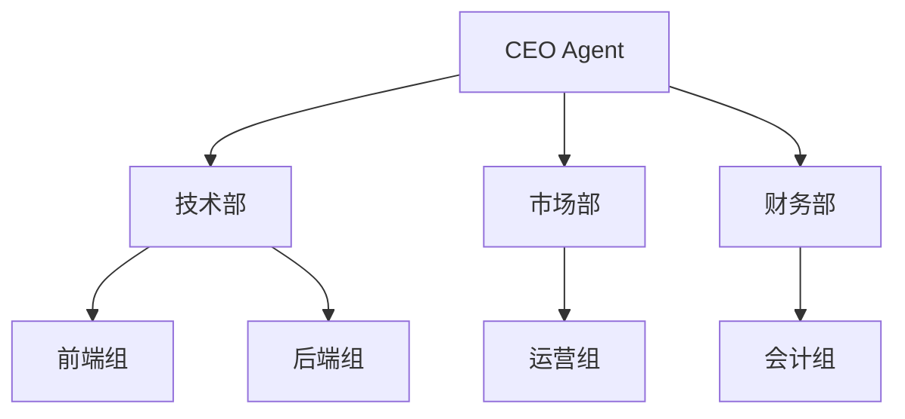

# 公司初始化与组织架构设计功能

**日期**: 2026-04-30  
**状态**: 已确认，待实现  
**参考**: https://github.com/garrytan/gstack

---

## 背景

Hermes Agent 项目已有完整的组织管理系统（`gateway/org/`），包含：
- 公司（companies）、部门（departments）、职位（positions）、Agent（agents）的完整CRUD
- SQLite数据库存储（`org.db`）
- 前端OrganizationPage + OrgNodeDialog组件
- API端点：`/api/org/companies`, `/api/org/departments`, `/api/org/agents`

**本功能目标**：在公司创建后，提供一键初始化能力，通过AI董事办讨论生成组织架构方案，可视化确认后自动创建。

---

## 用户流程

```
1. 用户创建公司（已有功能）
   ↓
2. 在公司卡片旁边看到 [初始化] 按钮（⚡图标）
   ↓
3. 点击按钮 → 弹出对话框输入董事Agent数量（默认3）
   ↓
4. 系统自动创建：
   - 部门："董事办"（department）
   - 3个董事Agent：CEO、CTO、CFO（agents）
   ↓
5. 自动打开ChatPage，scope=董事办
   ↓
6. 董事办Agent开始讨论：
   - CEO：读取公司name+goal，问3个关键问题
   - CTO：补充技术部门建议
   - CFO：补充财务部门建议
   ↓
7. 每次讨论后，相关Agent推送 📊 Mermaid架构图消息
   ↓
8. 用户可在聊天中反馈调整（"技术部改两个子部门"）
   ↓
9. 架构图实时更新，推送新版本
   ↓
10. 用户点击 [确认创建] → 批量创建部门/职位/Agent
```

---

## 前端设计

### 新增/修改组件

```
web/src/
├── components/
│   ├── organization/
│   │   └── InitCompanyButton.tsx    # 新增：公司卡片旁的初始化按钮
│   └── chat/
│       ├── ChatMessage.tsx          # 修改：支持sender_agent_id显示不同Avatar
│       ├── ArchitectureMessage.tsx   # 新增：Mermaid图消息组件
│       └── AgentMessageHeader.tsx   # 新增：Agent头像+角色标签
├── pages/
│   └── ChatPage/
│       └── index.tsx                # 修改：scope=董事办时自动触发讨论
└── lib/
    └── api.ts                      # 修改：新增API调用函数
```

### InitCompanyButton 组件

**位置**：`OrganizationHeader.tsx` 中公司名称旁边

```typescript
// 触发位置
<div className="company-card">
  <h3>{company.name}</h3>
  <InitCompanyButton companyId={company.id} />
</div>
```

**交互流程**：
1. 点击按钮 → 弹出 Dialog（使用现有 OrgNodeDialog 模式）
2. 输入字段：`agent_count`（数字输入，默认3，范围1-10）
3. 确认 → 调用 `POST /api/org/companies/:id/init-director-office`
4. 成功后 → 自动导航到 ChatPage，参数 `?scope=director-office&companyId=:id`

### ArchitectureMessage 组件

**新消息类型**：`type: 'architecture'`

```typescript
interface ArchitectureMessageData {
  id: string;
  type: 'architecture';
  mermaid_code: string;        // Mermaid 语法
  sender_agent_id: number;      // 发送者Agent ID
  sender_agent_role: string;     // 'CEO' | 'CTO' | 'CFO'
  version: number;               // 架构图版本（用户反馈后+1）
  editable: boolean;             // 是否可编辑（未来扩展）
}
```

**渲染实现**：
- 使用 `mermaid-js` 库（通过 CDN 或 npm 包）
- 消息气泡内嵌 `<div className="mermaid">{mermaid_code}</div>`
- 显示发送者信息：Agent头像 + 角色标签（CEO/CTO/CFO）
- 支持点击"调整"按钮后内联编辑 Mermaid 代码（可选）

**示例 Mermaid 代码**：


### ChatPage 扩展

**多Agent消息支持**：
- 消息列表现在包含 `sender_agent_id` 和 `sender_agent_role`
- 不同Agent的消息显示不同颜色/头像
- Agent消息在左侧，用户消息在右侧（现有逻辑）

**自动对话触发**：
```typescript
// ChatPage index.tsx
useEffect(() => {
  if (scope === 'director-office' && !discussionStarted) {
    // 触发董事办讨论
    startDirectorDiscussion(companyId);
    setDiscussionStarted(true);
  }
}, [scope, companyId]);
```

---

## 后端设计

### 新增 API 端点

| 端点 | 方法 | 说明 | 请求体 | 响应 |
|------|------|------|--------|------|
| `/api/org/companies/:id/init-director-office` | POST | 创建董事办+董事Agent | `{ agent_count: number }` | `{ department_id, agents: [...] }` |
| `/api/org/companies/:id/start-discussion` | POST | 触发董事办讨论 | 无 | `{ session_id, messages: [...] }` |
| `/api/chat/send-agent-message` | POST | Agent发送消息（含架构图） | `{ agent_id, content, mermaid_code }` | `{ message_id }` |
| `/api/org/companies/:id/confirm-architecture` | POST | 确认并批量创建组织 | `{ architecture: { departments: [...] } }` | `{ created: { departments, positions, agents } }` |

### OrganizationService 扩展

**文件**：`gateway/org/services.py`

```python
async def init_director_office(company_id: int, agent_count: int = 3) -> dict:
    """
    初始化董事办：
    1. 创建"董事办"部门
    2. 创建指定数量的董事Agent（CEO/CTO/CFO...）
    3. 返回部门ID和Agent列表
    """
    # 1. 创建董事办部门
    director_dept = await create_department(
        company_id=company_id,
        name="董事办",
        goal="公司战略决策与组织架构设计"
    )
    
    # 2. 预定义角色（最多agent_count个）
    roles = ["CEO", "CTO", "CFO", "COO", "CMO"][:agent_count]
    
    # 3. 创建Agent
    agents = []
    for i, role in enumerate(roles):
        agent = await create_agent(
            company_id=company_id,
            department_id=director_dept.id,
            name=f"{role} Agent",
            role=role,
            system_prompt=get_director_prompt(role)  # 见下方Prompt设计
        )
        agents.append(agent)
    
    return {
        "department_id": director_dept.id,
        "agents": agents
    }
```

### Agent 讨论触发

**文件**：`gateway/org/services.py` 或新增 `gateway/org/discussion.py`

```python
async def start_director_discussion(company_id: int) -> List[dict]:
    """
    触发董事办讨论：
    1. 读取公司信息（name, goal）
    2. 获取董事办下所有Agent
    3. 按角色顺序（CEO→CTO→CFO）触发讨论
    4. 每个Agent生成消息后，推送Mermaid架构图
    """
    company = await get_company(company_id)
    agents = await get_agents_by_department(company_id, "董事办")
    
    messages = []
    current_architecture = None
    
    # 按角色优先级排序：CEO > CTO > CFO
    role_priority = {"CEO": 1, "CTO": 2, "CFO": 3}
    sorted_agents = sorted(agents, key=lambda x: role_priority.get(x.role, 99))
    
    for agent in sorted_agents:
        # 调用Agent生成讨论消息
        message = await call_agent_to_discuss(
            agent_id=agent.id,
            company_info={
                "name": company.name,
                "goal": company.goal
            },
            current_architecture=current_architecture,
            discussion_history=messages  # 之前Agent的发言
        )
        messages.append(message)
        
        # 如果生成了架构图，更新current_architecture
        if message.get('mermaid_code'):
            current_architecture = message['mermaid_code']
    
    return messages
```

---

## Prompt 设计（简化版，聚焦解决问题）

### CEO Agent Prompt

```
You are the CEO Agent of {company_name}. Goal: {company_goal}

## Your Task
Design a PRACTICAL organization structure that solves real problems.

## Step 1: Ask 3 Clarifying Questions
1. "What are the TOP 3 problems your current team faces?"
2. "How many people will the company have in the next 6 months?"
3. "Which function is MOST critical right now: tech, sales, or operations?"

## Step 2: Propose 2-3 Department Options
Based on answers, propose departments with clear reasoning:
- Option A: Minimal (3 depts) - solves immediate problems
- Option B: Balanced (5 depts) - scales to 20 people  
- Option C: Full (7+ depts) - long-term vision

## Step 3: Output Format
1. **Text Message**: Your analysis and questions
2. **Mermaid Diagram**: 
   ```mermaid
   graph TD
       CEO[CEO] --> Dept1[Dept Name]
       CEO --> Dept2[Dept Name]
   ```
3. **Action**: [Continue Discussion] or [Ready to Confirm]

## Constraints
- Focus on solving problems, not abstract strategy
- Keep it practical: "We need X because Y pain"
- Each dept must have a clear goal
```

### CTO Agent Prompt

```
You are the CTO Agent of {company_name}.

## Your Focus
Technical departments and structure.

## After CEO's Proposal
1. Review the technical dept suggestions
2. Add specific recommendations:
   - Frontend/Backend split?
   - DevOps needs?
   - How many engineers per team?
3. Update Mermaid diagram to include tech reporting structure
4. Send message with updated diagram

## Example Addition
"Based on CEO's plan, I recommend splitting Tech Dept into:
- Frontend Team (2-3 people)
- Backend Team (3-4 people)  
- DevOps (1 person, part-time)

Updated diagram:"
[Updated Mermaid code]
```

### CFO Agent Prompt

```
You are the CFO Agent of {company_name}.

## Your Focus
Financial structure and cost centers.

## After CEO/CTO's Proposal
1. Review financial dept suggestions
2. Add recommendations:
   - Finance Dept (budget tracking)
   - HR Dept (hiring, payroll)
   - Which depts are cost centers vs revenue generators?
3. Update Mermaid to show budget flow
4. Send message with updated diagram

## Keep It Simple
- Don't over-think: a 10-person company doesn't need complex finance
- Focus on: "Who tracks money? Who hires people?"
```

---

## 数据流

### 完整流程序列图

```
用户          前端UI          后端API          董事办Agent
 │               │                │                │
 │──点击初始化──▶│                │                │
 │               │──POST init───▶│                │
 │               │                │──创建董事办──▶│
 │               │                │──创建3个Agent─▶│
 │               │◀──返回ID列表──│                │
 │               │                │                │
 │──打开Chat────▶│                │                │
 │               │──POST start──▶│                │
 │               │                │──读取公司信息─▶│
 │               │                │                │
 │               │                │◀──CEO提问─────│
 │               │◀──消息+图────│                │
 │               │──显示消息─────│                │
 │               │                │                │
 │◀──用户回答───│──POST msg────▶│                │
 │               │                │                │
 │               │                │◀──CTO补充────│
 │               │◀──消息+图────│                │
 │               │──显示消息─────│                │
 │               │                │                │
 │──确认创建────▶│──POST confirm─▶│                │
 │               │                │──批量创建─────▶│
 │               │◀──返回结果────│                │
```

---

## 技术考量

### 1. Mermaid 渲染

**方案选择**：使用 `mermaid-js` npm 包（已在多个项目验证）

```typescript
// ArchitectureMessage.tsx
import mermaid from 'mermaid';

// 初始化（在组件外）
mermaid.initialize({ 
  startOnLoad: false,
  theme: 'default'
});

// 渲染
const renderMermaid = async (code: string) => {
  const { svg } = await mermaid.render('mermaid-svg-' + messageId, code);
  return svg;
};
```

**备选方案**：如果包体积敏感，使用官方 Mermaid Live Editor API（需要网络）。

### 2. 多Agent消息存储

**现有消息表扩展**：

```sql
ALTER TABLE chat_messages ADD COLUMN sender_agent_id INTEGER REFERENCES agents(id);
ALTER TABLE chat_messages ADD COLUMN sender_agent_role TEXT;
ALTER TABLE chat_messages ADD COLUMN mermaid_code TEXT;
ALTER TABLE chat_messages ADD COLUMN architecture_version INTEGER DEFAULT 1;
```

### 3. 实时更新架构图

**方案**：用户反馈后，相关Agent重新生成Mermaid代码，作为新消息推送

- 不修改历史消息（不可变性）
- 每次调整生成新版本（version+1）
- 前端显示最新版本的架构图

### 4. 安全性

- 董事办Agent只能访问其所属公司的信息
- 初始化按钮只对 `company_id` 的所有者可用（现有权限系统）
- Agent调用使用后端API，不走前端直接调用LLM

---

## 验收标准

### 功能验收

- [ ] 公司卡片旁显示初始化按钮（⚡图标）
- [ ] 点击后弹出对话框，可输入1-10的数字（默认3）
- [ ] 确认后自动创建"董事办"部门 + N个董事Agent
- [ ] 自动跳转到ChatPage，scope=董事办
- [ ] CEO Agent自动开始讨论，显示3个关键问题
- [ ] 讨论后推送包含Mermaid架构图的消息
- [ ] CTO/CFO Agent依次补充建议，更新架构图
- [ ] 用户可在聊天中回复调整意见
- [ ] 调整后推送新版本架构图
- [ ] 点击"确认创建"后，批量创建部门/职位/Agent
- [ ] 创建完成后跳转到OrganizationPage查看结果

### 技术验收

- [ ] ArchitectureMessage组件正确渲染Mermaid图
- [ ] 不同Agent的消息显示不同头像/颜色
- [ ] 消息存储包含`sender_agent_id`和`mermaid_code`字段
- [ ] API端点返回正确的数据结构
- [ ] 错误处理：网络失败、LLM调用失败时有友好提示
- [ ] 国际化：中英文都支持（参考现有i18n系统）

### 用户体验验收

- [ ] 讨论过程流畅，无长时间卡顿（LLM调用显示loading）
- [ ] 架构图清晰可读，层次分明
- [ ] 用户调整后能快速看到更新后的架构图
- [ ] 确认创建前有明确的预览和取消选项

---

## 未来扩展（本期不包含）

- [ ] 架构图拖拽编辑（交互式调整）
- [ ] 导出组织架构为PDF/PNG
- [ ] 多轮讨论后的"最佳方案"投票机制
- [ ] 与其他公司模板的对比
- [ ] 董事办Agent的持久化记忆（学习用户偏好）

---

**文档版本**: v1.0  
**最后更新**: 2026-04-30  
**确认人**: 用户（通过brainstorming对话）
